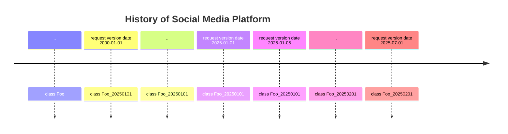

# classendar

```mermaid
timeline
    title History of Social Media Platform
    ..                     : class Foo
    request version date 2000-01-01 : class Foo_20250101
    ..                    : class Foo_20250101
    request version date 2025-01-01 : class Foo_20250101
    request version date 2025-01-05 : class Foo_20250101
    .. : class Foo_20250201
    request version date 2025-07-01 : class Foo_20250201
```

## assumptions

1. the dated classes must inherit from the base class.
2. the method to have the date functionality is `get`.

